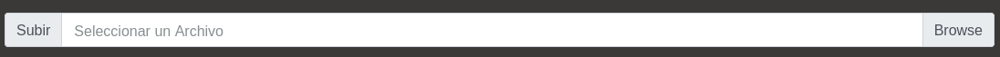
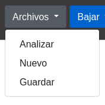
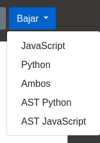
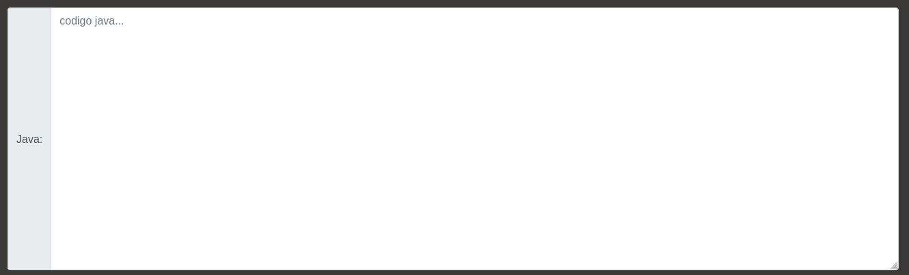
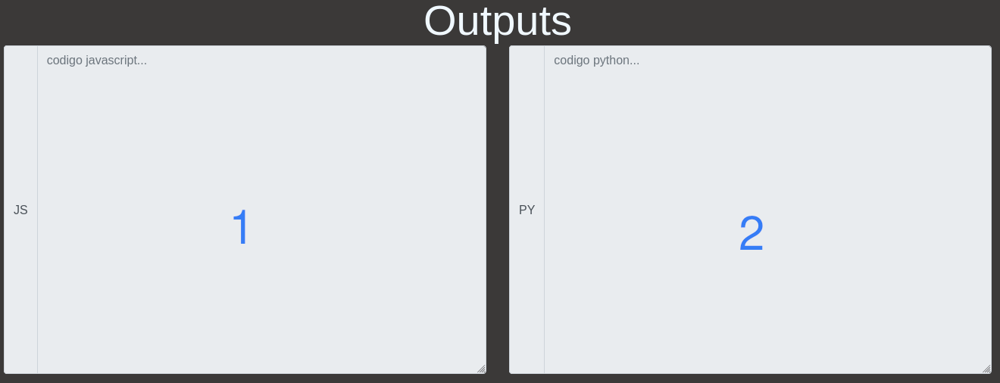
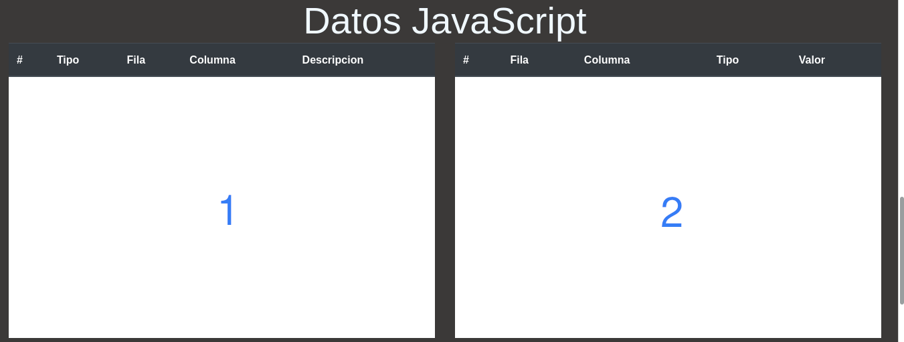
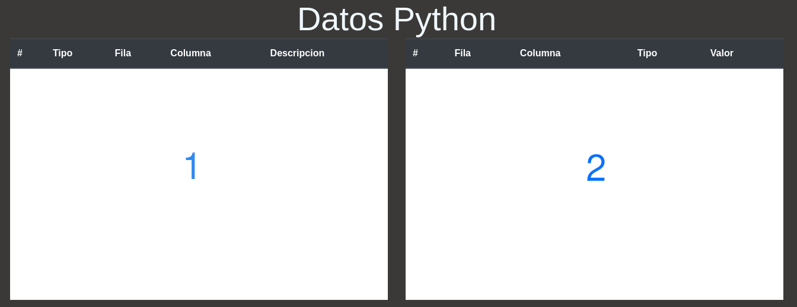

# Manual Usuario

## Selector de Archivos

El selector archivos ayuda a seleccionar una imagen del equipo local del usuario

## Menu "Archivos"

- Analizar

Manda a analizar el archivo de entrada a los servidores de traduccion JavaScript y Python

- Nuevo

Limpia todas las consolas y prepara la app para analizar un nuevo archivo

- Guardar

Guarda el actual el archivo de entrada

## Menu "Bajar"

- JavaScript

Guarda la actual salida de javascript

- Python

Guarda la actual salida de python

- Ambos

Guarda las actuales salidas de javascript y python

- AST Python

Permite visualizar el arbol AST generado por el analizador de python y la posibilidad de poder guardarlo

- AST JavaScript

Permite visualizar el arbol AST generado por el analizador de python y la posibilidad de poder guardarlo

## Entrada

Permite la visualizacion del archivo de entrada antes de mandarlo a traducir

## Salida

**1:** Permite la visualizacion de la traduccion de java a javascript

**2:** Permite la visualizacion de la traduccion de java a python

## Consola JavaScript

**1:** Permite la visualizacion de errores lexicos y sintacticos de la traduccion de java a javascript

**2:** Permite la visualizacion de tokens reconocidos de la traduccion de java a javascript

## Consola Python

**1:** Permite la visualizacion de errores lexicos y sintacticos de la traduccion de java a python

**2:** Permite la visualizacion de tokens reconocidos de la traduccion de java a python