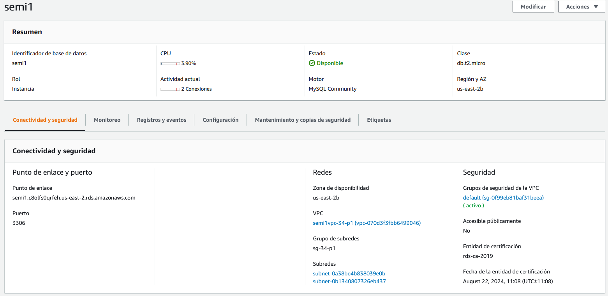

# Manual Tecnico

# Objetivos
- El usuario pueda comprender como se estructura del proyecto U-Storage y cada uno de sus componentes
- Explorar la configuracion de los componentes en la nube Amazon Web Services (AWS) para la implementacion de este proyecto

# Arquitectura


---
## Redes (VPC, Load Balancer)
Se configuro una vpc con IPv4 10.0.1.0/16, para contener 2 subredes una publica que tendra acceso a internet y sera usado para acceder a la instancias de EC2 y una privada donde funcionara una instancia de RDS


### Subred Publica
	- IPv4 10.0.1.0/24
	- Internet Gateway

### Subred Privada
	- IPv4 10.0.2.0/24

### Load Balancer
	- Destino HTTP:80/usuario
	- Espera de 5 segundos
	- Intervalos de 30 segundos 
	- Host http://loadbalancer-34-p1-2028084671.us-east-2.elb.amazonaws.com/

---
## Api (EC2)
Se configuraron 2 EC2 para servir una aplicacion REST API basada en Express y NodeJS, ambas EC2 se encuentran dentro de la subred publica


Motor: **Ubuntu**

Documentacion de la API:
 https://documenter.getpostman.com/view/17226007/TzzEouY4

 ---
## Base de datos (RDS)

El servicio de base de datos RDS, se configuro para ser usado dentro de una subred privada y puede ser accesible unicamente desde la subred publica por las instancias de EC2



Motor: **MySQL**

Script:

```sql
create table usuario (
	id integer auto_increment,
	nombre varchar(250),
	email varchar(250),
	password varchar(250),
	foto varchar(250),
	primary key (id)
);

create table archivo (
	id integer auto_increment,
	nombre varchar(250),
	extension varchar(250),
	public boolean default false,
	fecha bigint,
	datos varchar(250),
	primary key (id)
);

create table amigos (
	usuario1 integer,
	usuario2 integer,
	foreign key (usuario1) references usuario (id),
	foreign key (usuario2) references usuario (id),
	primary key (usuario1, usuario2)
);

create table carpeta (
	usuario integer,
	archivo integer,
	foreign key (usuario) references usuario (id),
	foreign key (archivo) references archivo (id),
	primary key (usuario, archivo)
);

```

---
## Almacenamiento (S3)

### Archivos - semi1archivos
Bucket de acceso publico que almacena los archivos subidos por los usuarios de la plataforma, los archivos se dividen en dos carpetas
  
	- archivos/ - Almacena los archivos del usuario
	- fotos/ - Almacena las fotos de perfil del usuario

### Pagina Web - appweb-34-p1
Bucket de acceso public que sirve una pagina web estatica con las siguientes politicas

```json
{
    "Version": "2012-10-17",
    "Statement": [
        {
            "Sid": "PublicReadGetObject",
            "Effect": "Allow",
            "Principal": "*",
            "Action": "s3:GetObject",
            "Resource": "arn:aws:s3:::appweb-34-p1/*"
        }
    ]
}
```


