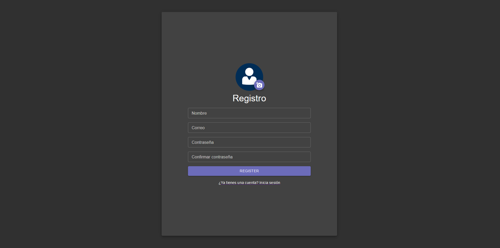
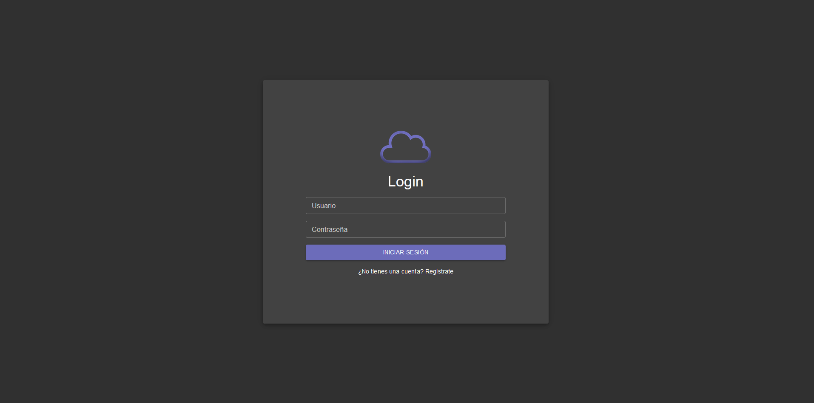
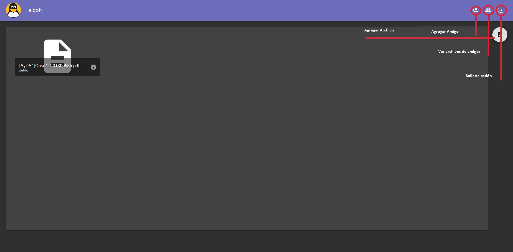
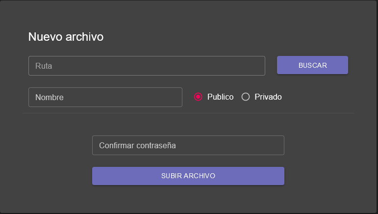
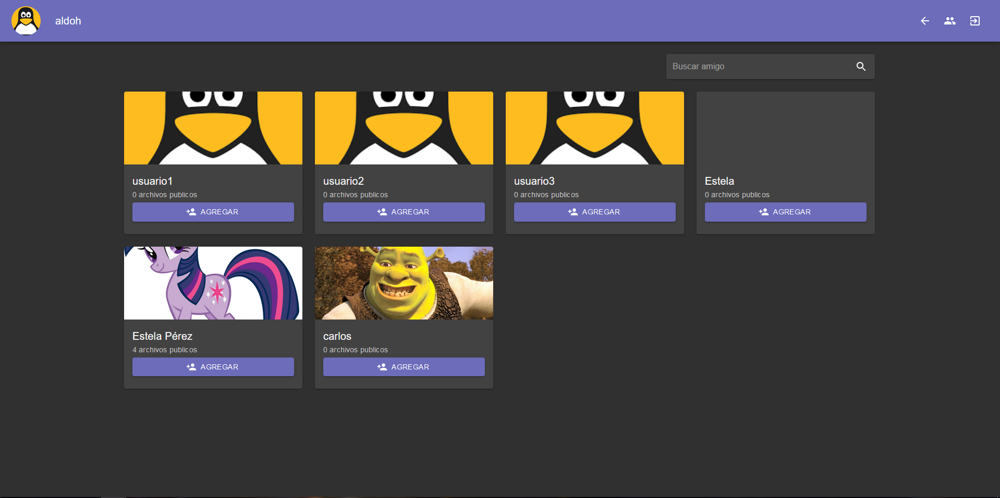
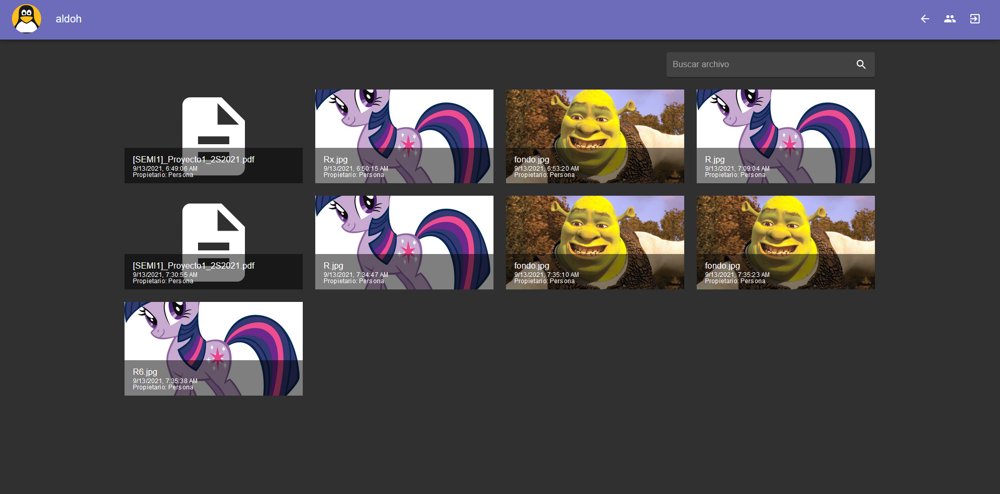

# Manual de Usuario

U-Storage es una plataforma de servicio online especializada en el almacenamiento de archivos de acceso públicos y privados con opciones de agregar amigos y poder ver sus archivos compartidos y con la posibilidad de compartir nuestros propios archivos para que estos los pudan ver y tambien tener la opcion de guardar archivos en modo secreto

## Registro de usuarios
En esta pantalla se podran ingresar nuevos usuarios, ingresando los datos correspondientes

## Inicio de sesion
En esta pantalla los usuarios podran iniciar sesion e ingresar a la plataforma, ingresando sus credenciales correctamente

## Dashboard
Esta sera la pantalla principal que vera el usuario una vez se logee, en ella podra navegar a la pantalla de agregar amigos o ver archivos publicos (de los amigos)

## Agregar Archivo
Esta es una vista que salta cuando el usuario desea subir un archivo, debera llenar todos los datos correspondientes para subir el archivo

## Agregar Amigo
En esta pantalla el usuario podra visualizar todos los usuarios que se encuentran registrados en la plataforma y agregarlos como amigos

## Archivos publicos

En esta pantalla el usuario podra visualizar todos los archivos publicos de los usuarios que tiene agregado como amigos

