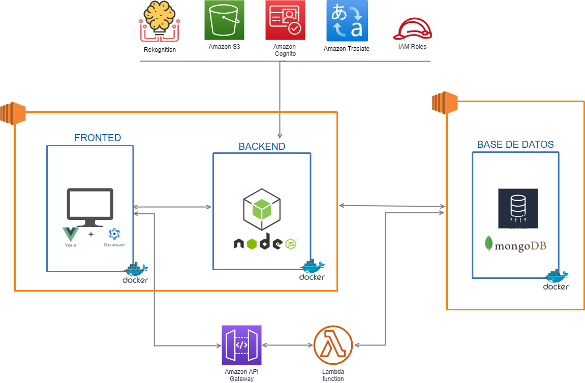

# Arquitectura
## _Diagrama_

Se implementó una arquitectura monolítica en la cual todos los elementos o servicios están integrados como un todo. Esto con la finalidad de una implementación más practica y un despligue más cómodo. 

Teconología utilizadas:

### Quasar 
Es un marco basado en Vue.js de código abierto con licencia del MIT, que le permite crear rápidamente sitios web.
Debido a la simplicidad y la potencia que ofrece desde el primer momento, Quasar, con su CLI, está repleto de funciones, todas diseñadas para facilitar la vida de su desarrollador.

### NodeJS
Para la implementación del backend se ha elegido utilizar Nodejs. Utiliza la arquitectura
«Single Threaded Event Loop» para manejar múltiples clientes al mismo tiempo. Para
entender en qué se diferencia de otros tiempos de ejecución, tenemos que entender cómose manejan los clientes concurrentes multihilo en lenguajes como Java.

### MongoDB
MongoDB es una base de datos distribuida, basada en documentos y de uso general que ha sido diseñada para desarrolladores de aplicaciones modernas y para la era de la nube. Ninguna otra ofrece un nivel de productividad de uso tan alto

### Docker
Tanto la base de datos como el backend y frontend del proyecto se encuentran alojados en uncontenedor de docker.
Docker es una plataforma de software que le permite crear, probar e implementar
aplicaciones rápidamente. Docker empaqueta software en unidades estandarizadas
llamadas contenedores que incluyen todo lo necesario para que el software se ejecute,incluidas bibliotecas, herramientas de sistema, código y tiempo de ejecución. Con Docker se puede implementar y ajustar la escala de aplicaciones rápidamente en cualquier entorno con la certeza de saber que su código se ejecutará.

## AWS
Es un servicio de nube pública que entrega soluciones como servicios para el desarrollo de arquitecturas y proyectos.
Se utilizaron los servicios:
> S3
> EC2
> Cognito
> Translate
> Rekognition
> API Gateway 
> Función Lambda
