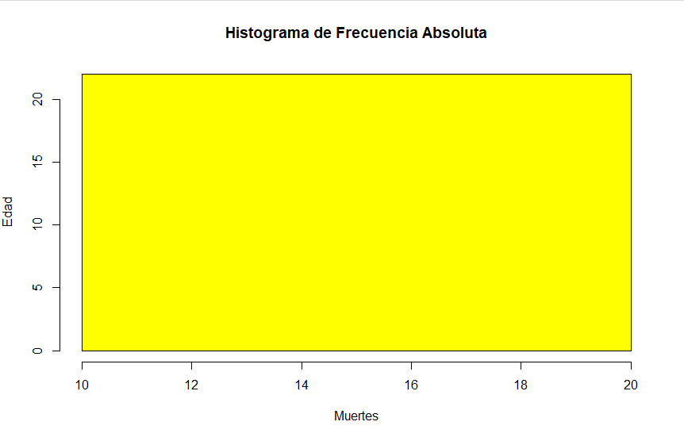
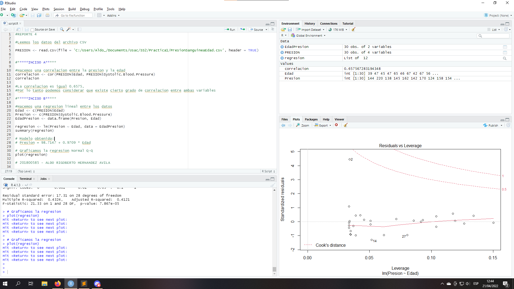

# DOCUMENTACION

## **REPORTE 1**

```console
#REPORTE1

#Leemos los datos del archivo Ventas del csv
VENTAS <- read.csv(file = 'C:/Users/Aldo_/Documents/Usac/SS2/Practica1/VENTAS.csv', header = TRUE)
VENTAS <- data.frame(VENTAS)

#*******INCISO A*********

#Se aplica el filtro para poder obtener unicamente los datos necesarios
filtro <-  VENTAS[VENTAS$Country == "Guatemala"| VENTAS$Country == "El Salvador" | VENTAS$Country == "Honduras" | VENTAS$Country == "Nicaragua" | VENTAS$Country == "Costa Rica" | VENTAS$Country == "Panama" | VENTAS$Country == "Belice" ,]

# Se obtiene la frecuencia absoluta y se guarda en una tabla
frecuencia_absoluta <- table(filtro$Country)
frecuencia_absoluta

#*******INCISO B*********

# Generamos una grafica de barras para la frecuencia absoluta
barplot(frecuencia_absoluta, main = "Ventas Centroamerica", col = "cyan", xlab = "Paises", ylab = "Frecuencia")

#*******INCISO C*********

# Se obtiene la frecuencia acumulada, a partir de la frecuencia absoluta
frecuencia_acumulada <- cumsum(frecuencia_absoluta)
frecuencia_acumulada

#Generamos el histograma para las frecuencias absolutas
hist(frecuencia_acumulada, main = "Histograma", ylab = "Paises", col = "pink", xlab = "Ventas")

# 201800585 - ALDO RIGOBERTO HERNANDEZ AVILA

```


### Grafica de barras: frecuencias absolutas


### Histograma: frecuencia acumulada


## **REPORTE 2**

```console
#REPORTE2

#Leemos los datos del archivo Ventas del csv
DESEMPENO <- read.csv(file = 'C:/Users/Aldo_/Documents/Usac/SS2/Practica1/DesempenioCPU.csv', header = TRUE)
DESEMPENO <- data.frame(DESEMPENO)


#*****INCISO A*****
#Obtenemos los datos de la compania amdahl
amdahl <- DESEMPENO[DESEMPENO$Compania == "amdahl" ,]

#Calculamos las metricas
maxFiltro <- max(amdahl$PRP)
minFiltro <- min(amdahl$PRP)
meanFiltro <- mean(amdahl$PRP)

#Graficamos las metricas
barplot(c(maxFiltro,meanFiltro,minFiltro), main = "Rendimiento de CPUs amdahl", col = "cyan", xlab = "M�tricas", ylab = "PRP", names.arg = c("M�ximo","Promedio","M�nimo"))


#*****INCISO B*****
#Instalamos las librerias para hacer el analisis correctamente
install.packages("dplyr")
library("dplyr")

#Agrupamos los datos por compania y calculamos la media de los datos agrupados
query <- DESEMPENO %>%  group_by(Compania) %>% summarise(mean = mean(PRP))

#Sacamos el maximo y el minimo
filtroMax <- max(query$mean)
filtroMin <- min(query$mean)
filtroTabla <- query[query$mean == filtroMax | query$mean == filtroMin ,]


barplot(filtroTabla$mean, main = "Rendimiento", col = "pink", xlab = "Compania", ylab = "Rendimiento Medio", names.arg = filtroTabla$Compania)

# 201800585 - ALDO RIGOBERTO HERNANDEZ AVILA
```


### Gráfica de barras: rendimiento de los cpus amdahl


### Gráfica de barras: comparacion de empresas


## **REPORTE 3**

```console
#REPORTE3

#Leemos los datos del archivo CSV
MUERTES <- read.csv(file = 'C:/Users/Aldo_/Documents/Usac/SS2/Practica1/MuertesSexoEdad.csv', header = TRUE)
MUERTES <- data.frame(MUERTES)

#Eliminamos la palabra Total
MUERTES <- MUERTES[MUERTES$Sex != "Total",]
MUERTES <- MUERTES[MUERTES$Age != "Total",]


#*****INCISO A*****

# Sacamos la frecuencia de los rangos de edad
frecuencia_absoluta <- table(MUERTES$Age)
frecuencia_absoluta


#*****INCISO B*****
hist(frecuencia_absoluta, main = "Histograma de Frecuencia Absoluta", ylab = "Edad", col = "yellow", xlab = "Muertes")


#*****INCISO C*****
plot(frecuencia_absoluta,type="l",col="red", ylab=" ", main="Poligono de frecuencias")


#*****INCISO D*****
frecuencia_acumulada <- cumsum(frecuencia_absoluta)
frecuencia_acumulada

barplot(frecuencia_acumulada, main = "Frecuencia Acumulada", col = "orange", xlab = "Edad", ylab = "Muertes")

# 201800585 - ALDO RIGOBERTO HERNANDEZ AVILA

```


### Tabla de frecuencias de muertes


### Histograma de frecuencia absoluta



### Poligono de frecuencias


### Diagrama de frecuencia acumulada


## **REPORTE 4**

```console
#REPORTE 4

#Leemos los datos del archivo CSV

PRESION <- read.csv(file = 'C:/Users/Aldo_/Documents/Usac/SS2/Practica1/PresionSanguineaEdad.csv', header = TRUE)


#*****INCISO A*****

#Hacemos una correlacion entre la presion y la edad
correlacion <- cor(PRESION$Edad, PRESION$Systolic.Blood.Pressure)
correlacion

#La correlacion es igual 0.6575, 
#Por lo tanto podemos considerar que existe cierto grado de correlacion entre ambas variables

#*****INCISO B*****

#Hacemos una regresion lineal entre los datos
Edad <- c(PRESION$Edad)
Presion <- c(PRESION$Systolic.Blood.Pressure)
EdadPresion <- data.frame(Presion, Edad)

regresion <- lm(Presion ~ Edad, data = EdadPresion)
summary(regresion)

# Modelo obtenido:
# Presion = 98.7147 + 0.9709 * Edad

# Graficamos la regresion Normal Q-Q
plot(regresion)

# 201800585 - ALDO RIGOBERTO HERNANDEZ AVILA 
```



### Regresion lineal


## **REPORTE 5**

```console
#REPORTE 5

#Leemos los datos del archivo CSV

DATOS <- read.csv(file = 'C:/Users/Aldo_/Documents/Usac/SS2/Practica1/PobrezaDesempleoAsesinatos.csv', header = TRUE)
DATOS <- data.frame(DATOS)

#*****INCISO A*****
#Sacamos los datos reales quitando los porcentajes

pobreza <- DATOS$Habitantes * (DATOS$Porcentaje.con.ingresos.debajo.de.5000 / 100)
pobreza <- data.frame(pobreza)

desempleo <- DATOS$Habitantes * (DATOS$Porcentaje.desempleado / 100)
desempleo <- data.frame(desempleo)

asesinatos <- DATOS$Habitantes * (DATOS$Asesinatos.por.1000000.habitantes / 100)
asesinatos <- data.frame(asesinatos)

#Hacemos una analisis correlativo entre pobreza-desempleo y pobreza-asesinato

pobrezaDesempleo <- cor(pobreza, desempleo)
pobrezaAsesinato <- cor(pobreza, asesinatos)

#La correlacion entre pobreza y desempleo es:
#0.995
#La correlacion entre pobreza y asesinatos es:
#0.923
#En ambos casos los datos esta muy relacionados

#*****INCISO B*****

#Hacemos la regresion lineal para los datos y extraemos el modelo
regresionPD <- lm(pobreza ~ desempleo, data = data.frame(pobreza, desempleo))
summary(regresionPD)
plot(regresionPD)
# El modelo obtenido es:
# Pobreza = -8934 + 2.984 * Desempleo

regresionPA <- lm(pobreza ~ asesinatos, data = data.frame(pobreza, asesinatos))
summary(regresionPA)
plot(regresionPA)
# El modelo obtenido es:
# Pobreza = -5015 + 0.9823 * Asesinatos

# 201800585 - ALDO RIGOBERTO HERNANDEZ AVILA
```


### Regresion lineal entre pobreza y desempleo


### Regresion lineal entre pobreza y asesinatos


