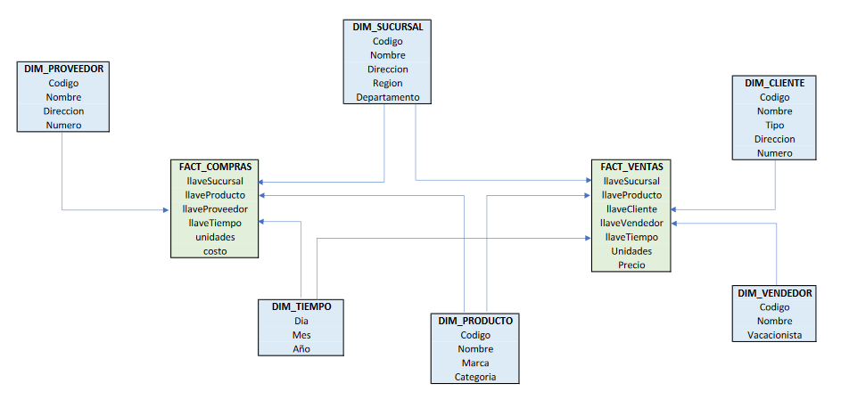

# One-Solution BI

## Modelo Datawarehouse

Se opto por usar un modelo constelacion, debido a que hay datos de dimensiones que se repiten en ambas fuentes de datos. por lo tanto lo mas optimo es hacer dimensiones compartidas para esos datos y asi poder correlacionar ventas con compras.

## Extración de Datos

- Los archivos fuentes de informacion se almacenaran en dos carpetas
  - compras: Para los datos de compras con extension .cp
  - ventas: Para los datos de ventas con extension .vt

- Se ejecuta un script que carga todos los archivos de las carpetas a tablas temporales o pivotes de la base de datos

## Transformacion de Datos

- Se hicieron las siguientes transformaciones:
  - los numeros telefonicos: `varchar => bigint`
  - booleanos: `['0', '1', 'S', 'N'] => bit (true o false)`
  - costos y precios: `varchar => decimal(18,2)`
  - fechas: `'2022-02-02' => 2022, 2, 2 (se dividio la fecha en campos)`

## Carga de Datos

- Una vez los datos fueron transformados, se cargaron a las dimensiones
- En el caso de las dimensiones DIM_SUCURSAL, DIM_PRODUCTO y DIM_TIEMPO, se unieron los datos de ambas fuentes para cargarlo a una sola
- Se realizo un lookup sobre cada dimension para obtener las llaves subrogadas que se crearon en el proceso
- Se cargaron las tablas de hechos con sus metricas y llaves subrogadas extraidas del paso anterior
