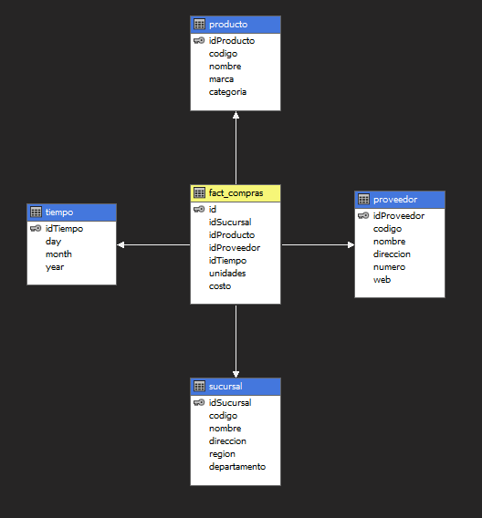
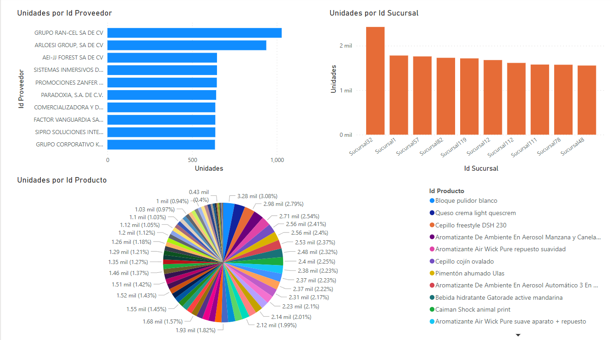
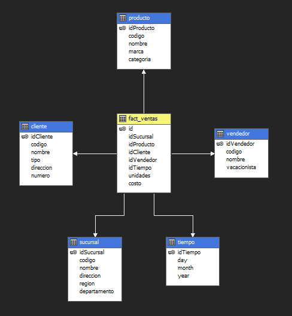
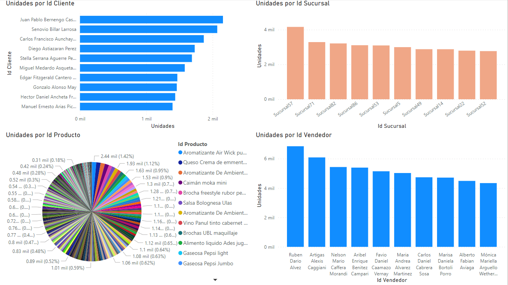

# OneSolution - BI

## Datamart - Compras

## Tablero de Power-BI Compras

El tablero de reportes de Power-BI esta diseñado para ver un resumen de unidades compradas por sucursales, por proveedor:

## Datamart - Ventas

## Tablero de Power-BI Ventas

El tablero de reportes de Power-BI esta diseñado para ver un resumen de unidades vendidas por vendedor, sucursales y por cliente:

# Conclusiones

Dado que el volumen de datos evaluado para este proyecto no es considerablemente grande, es casi imperceptible ver una diferencia en el rendimiento de los cubos, se podria considerar que en ambos tipos de cubos tanto lineal y columnar el rendimiento es practicamente igual.
